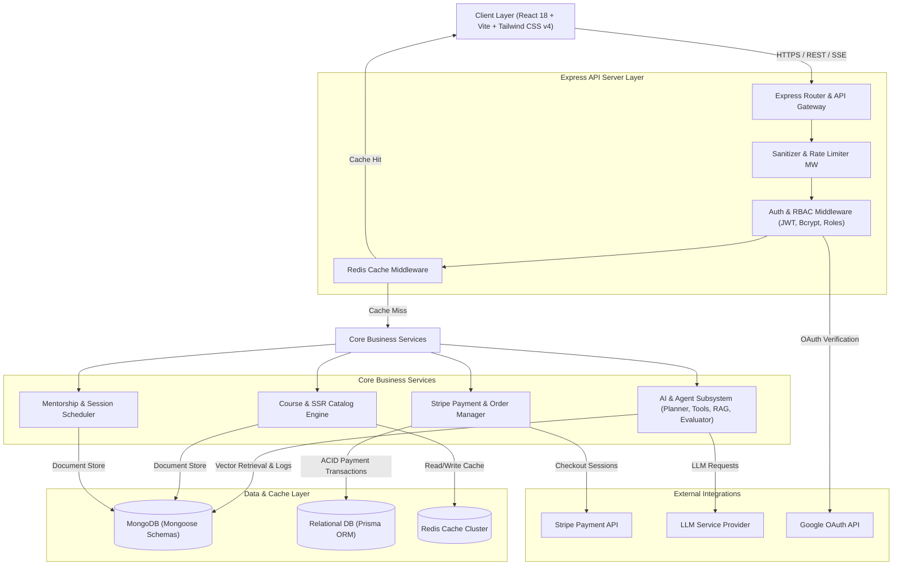
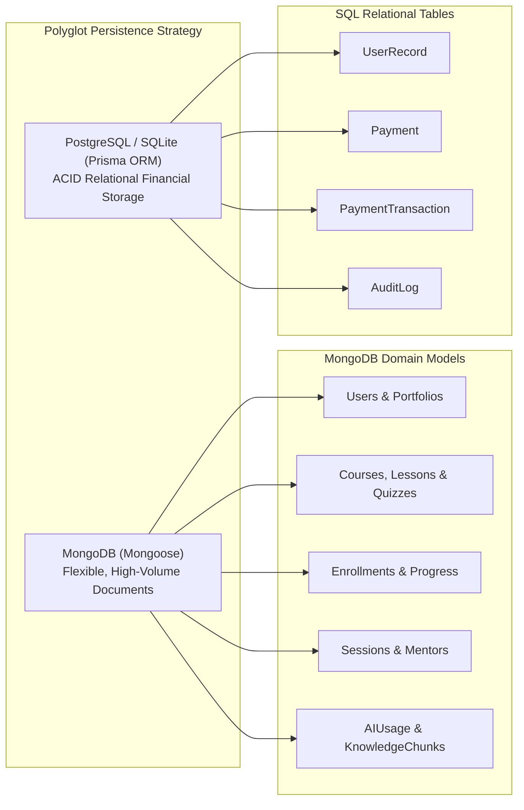
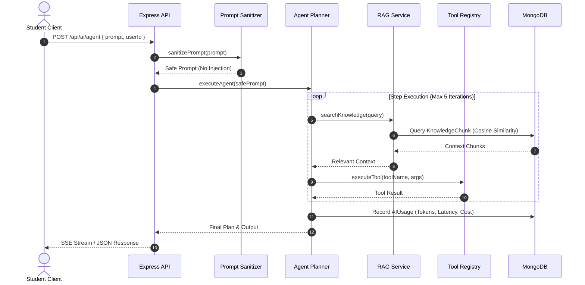
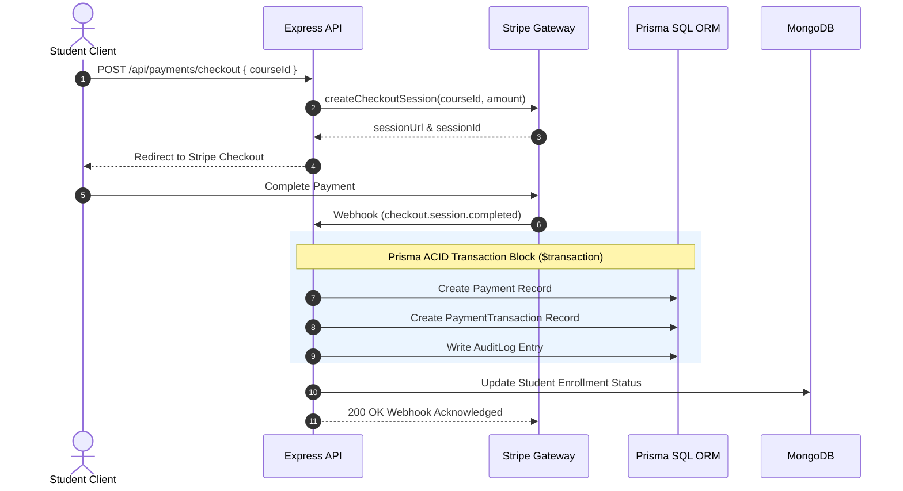

# ExplainAI - High-Level Design (HLD) Document

## 1. System Architecture Overview

**ExplainAI** utilizes a modern, multi-tiered micro-services-ready architecture built for scalability, real-time AI capabilities, security, and dual-database polyglot persistence. The platform decouples presentation logic (React/Vite) from backend services (Node.js/Express) while leveraging specialized datastores for operational flexibility (MongoDB) and transactional rigor (PostgreSQL via Prisma ORM).

### 1.1 High-Level Block Diagram

---

## 2. Subsystem Descriptions

### 2.1 Presentation / Client Layer
- **Framework**: React 18 single-page application built with Vite and styled using Tailwind CSS v4.
- **State Management**: Local React state (`useState`, `useEffect`) combined with global Zustand store (`useAppStore`) for app-wide state management.
- **Real-Time Streaming**: Native `fetch` with `ReadableStream` reader handling Server-Sent Events (SSE) for token-by-token AI response rendering.
- **Educational UI Components**: `JSConceptsDemo` educational sandbox showcasing closure, event loop, hoisting, promises, and async execution.

### 2.2 API Gateway & Security Layer
- **Express.js Application Pipeline**: Centralized routing (`app.js`, `server.js`) handling incoming HTTP requests.
- **Input Sanitization**: `sanitizeInput.js` intercepting body, query, and path parameters to eliminate NoSQL operator injections (`$gt`, `$where`) and XSS tags.
- **Rate Limiting**: Tiered limiters (`rateLimiter.js`) restricting high-frequency endpoints (20 req/15m on Auth, 50 req/15m on AI).
- **Authentication & RBAC**: JWT verification (`authMiddleware.js`) and role checks (`roleMiddleware.js`) enforcing permission rules for `student`, `mentor`, and `admin` roles.

### 2.3 AI Subsystem Architecture
- **Autonomous Planner Agent** (`agentService.js`, `planner.js`): Executes iterative reasoning loops (up to 5 steps) with max timeout guards and state tracking.
- **Tool Calling Architecture** (`server/services/tools/`): Modular tool execution registry supporting calculator operations, course search, user progress retrieval, flashcard creation, and quiz generation.
- **RAG Retrieval Engine** (`ragService.js`): Chunking engine (~400 chars per chunk), 64D vector embedding generator, and cosine similarity ranking over `KnowledgeChunk` collection.
- **Prompt Sanitizer & Redactor** (`promptSanitizer.js`): System prompt defense shielding system instructions from user override attempts and masking sensitive API tokens.
- **AI Analytics & Cost Tracker**: Logs token usage, execution latency, and financial costs into MongoDB `AIUsage` collection.

### 2.4 Dual-Database Data Layer

- **MongoDB (Mongoose Schemas)**: Document-oriented database storing flexible entities such as courses, embedded quizzes, enrollments, mentorship sessions, and RAG knowledge chunks.
- **Relational Database (Prisma ORM)**: Strictly normalized 3NF relational datastore guaranteeing ACID properties for payments, financial transactions, and audit records.

### 2.5 Caching & Integration Layer
- **Redis Caching** (`cacheMiddleware.js`, `redis.js`): Caches expensive catalog queries (`GET /api/courses`) with configurable TTL and automatic fallback to database if Redis is unavailable.
- **Stripe Gateway**: Secure external payment integration managing checkout session creation, webhook validation, and payment verification.
- **Background Cron Scheduler** (`cronService.js`): Automated `node-cron` tasks managing temp file cleanup and automated cost reporting.

---

## 3. Core Data Flow Sequences

### 3.1 AI Streaming & Autonomous Tool Calling Flow

### 3.2 Financial Checkout & ACID Payment Transaction Flow

---

## 4. Key Architectural Patterns & Decisions

1. **Polyglot Persistence**: Seeding high-volume document data in MongoDB while isolating financial state in Prisma SQL tables ensures maximum throughput for educational content alongside strict ACID compliance for financial logs.
2. **Strategy Pattern for AI Tools**: All tools export a uniform interface (`name`, `description`, `execute`), enabling dynamic invocation by the AI agent without hardcoding branching statements.
3. **Defense in Depth**: Multi-layer security consisting of rate limiting at gateway, request body sanitization, regex prompt injection shielding, JWT auth, and granular RBAC checks.
4. **Resilient Third-Party Integrations**: External API calls are wrapped with 4-second execution timeouts, exponential retry policies, and fallback content generators.
5. **SEO-Optimized SSR**: Server-Side Rendering route `/ssr/courses` builds pre-rendered HTML on Express server to ensure instant indexing by search engines.

---

## 5. Deployment & Container Topology

ExplainAI is containerized using Docker Compose for deterministic deployment across development, staging, and production environments:

- `client` container: Vite React frontend built and served via lightweight Nginx / Node container.
- `server` container: Express.js REST API worker process.
- `mongo` container: MongoDB database service.
- `redis` container: Redis in-memory caching service.
